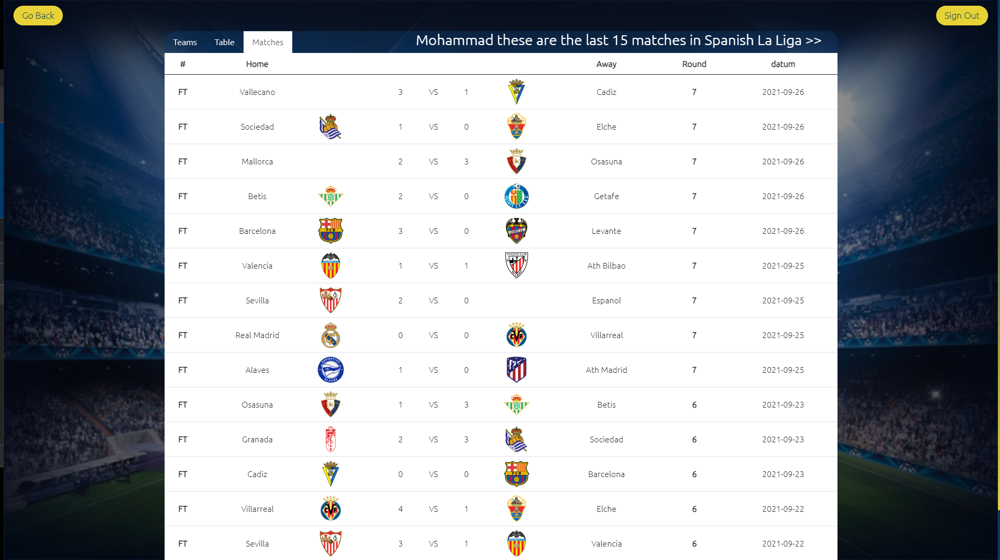

# Welcome to the football_Project_API [Demo](https://mohammadalnajar.github.io/football_Project_API/)

#### This Javascript project was a part of my study in the API_module at HackYourFuture institute in Amsterdam.

#### The app consists of the following parts:

1. **Signup/Signin page** 

    
   
2. **Leagues List** where you can see all leagues available.
   
   

3. **League page** where you can see all clubs in the selected league with the
   table and the last 15 matches.

    <div style="display: flex; flex-wrap:wrap">
      
      
      
    </div>
      
4. **Club details page** where you can find details about your selected club in
   available languages with a map for the city of that club.

   

5. The application is mobile ***Responsive*** which means everything will fit well at small
   screens as well.

___
### Languages and tools:

- **HTML**
- **CSS**
- **Javascript** 

#### Libraries and Frameworks:

- **Bootstrap 5**
- **LeafletJs** JavaScript library for mobile-friendly interactive maps.


### APIs:

- ***Openstreetmap*** to get the map data.
- ***Opencagedata*** to get latitude and longitude of a location.
- ***Thesportsdb*** to get football data.

___
In case you want to run the application on your **local machine** follow the next steps please:

- After cloning the code into your machine please do the next steps:


1. Install the following extension in your vscode [Live server Extension](https://marketplace.visualstudio.com/items?itemName=ritwickdey.LiveServer).
2. Open your terminal and run the command `live-server`.

### And that's it, the application now should run successfully on your machine.

____

## Folder Structure:

```
 ┣ assets                     ## All images
 ┣ public                     ## External css
 ┃ ┗ style.css
 ┣ src
 ┃ ┣ handlers                 ## functions that handle user interactions
 ┃ ┣ init                     ## initialisation code, run once when the application starts
 ┃ ┣ utils                    ## pure functions get data and return back a result
 ┃ ┣ views                    ## To make the DOM elements
 ┣ index.html
 ┗ README.md
```